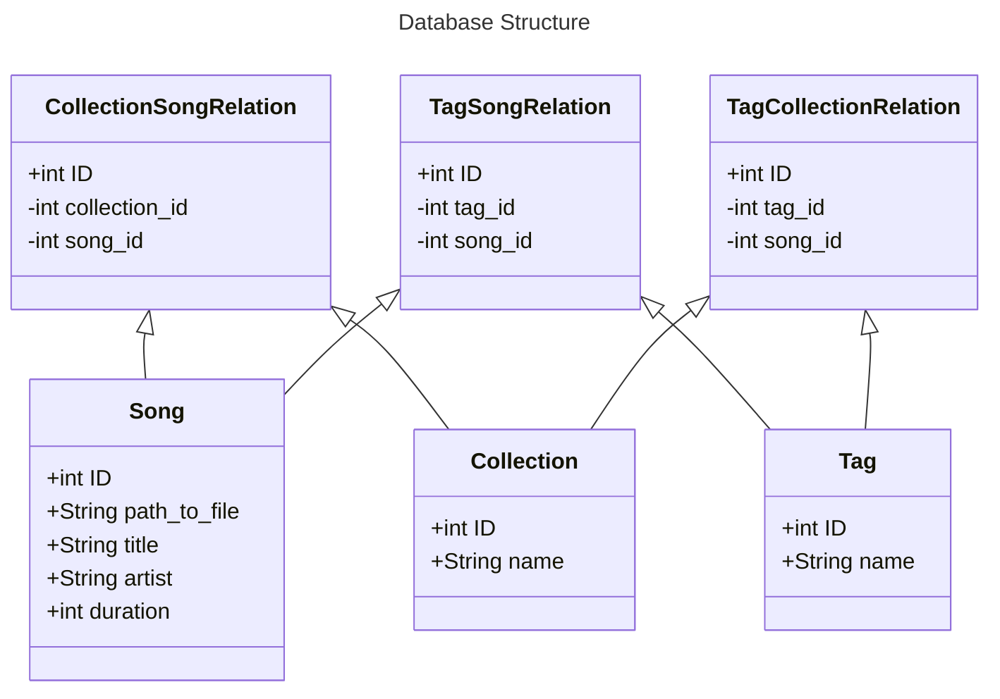

```mermaid

---
title: Database Structure
---
classDiagram

  CollectionSongRelation <|-- Song
  CollectionSongRelation <|-- Collection
  TagSongRelation <|-- Tag
  TagSongRelation <|-- Song
  TagCollectionRelation <|-- Tag
  TagCollectionRelation <|-- Collection

  
  class Song{
    +int ID
    +String path_to_file
    +String title
    +String artist
    +int duration
  }
  class Collection{
    +int ID
    +String name
  }
  class Tag{
    +int ID
    +String name
  }
  class CollectionSongRelation{
    +int ID
    -int collection_id
    -int song_id
  }
  class TagSongRelation{
    +int ID
    -int tag_id
    -int song_id
  }
  class TagCollectionRelation{
    +int ID
    -int tag_id
    -int song_id
  }
  
  


```
