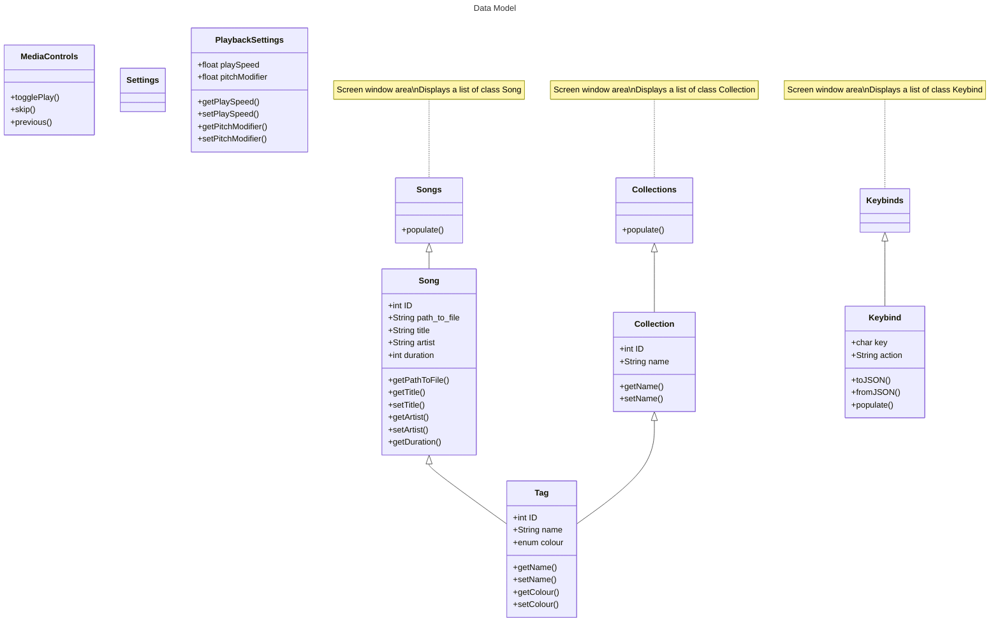
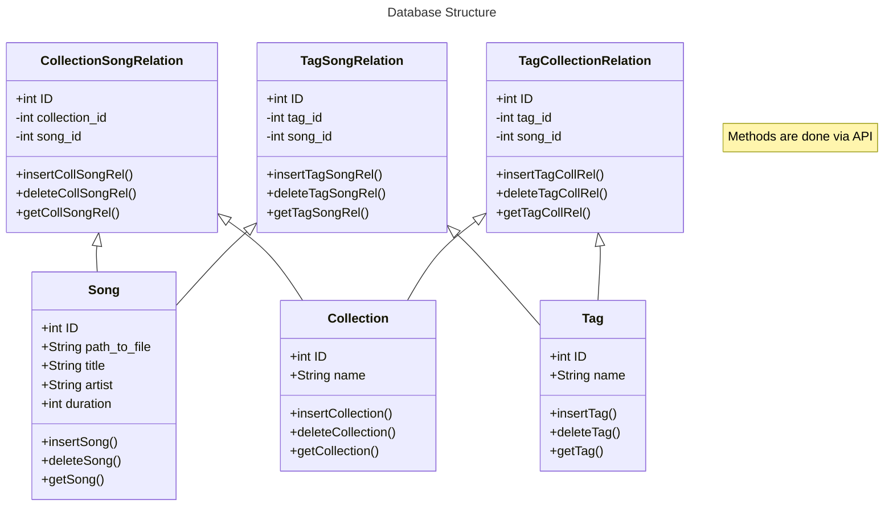

# Developer documentation
Following is the UML and design documentation for the development of MPFree. If you wish to contribute, please start here

# Data Model

```mermaid
---
title: Data Model
---
classDiagram

  Songs <|-- Song
  Collections <|-- Collection
  Song <|-- Tag
  Collection <|-- Tag
  Keybinds <|-- Keybind
  note for Songs "Screen window area\nDisplays a list of class Song"
  note for Collections "Screen window area\nDisplays a list of class Collection"
  note for Keybinds "Screen window area\nDisplays a list of class Keybind"

  class Song{
    +int ID
    +String path_to_file
    +String title
    +String artist
    +int duration
    +getPathToFile()
    +getTitle()
    +setTitle()
    +getArtist()
    +setArtist()
    +getDuration()
  }
  class Songs{
    +populate()
  }
  class Collection{
    +int ID
    +String name
    +getName()
    +setName()
  }
  class Collections{
    +populate()
  }
  class Tag{
    +int ID
    +String name
    +enum colour
    +getName()
    +setName()
    +getColour()
    +setColour()
  }
  class Keybind{
    +char key
    +String action
    +toJSON()
    +fromJSON()
  }
  class Keybind{
    +populate()
  }
  class MediaControls{
    +togglePlay()
    +skip()
    +previous()
  }
  class Settings{
    
  }
  class PlaybackSettings{
    +float playSpeed
    +float pitchModifier
    +getPlaySpeed()
    +setPlaySpeed()
    +getPitchModifier()
    +setPitchModifier()
  }

```

# Database documentation

```mermaid

---
title: Database Structure
---
classDiagram

  note "Methods are done via API"

  CollectionSongRelation <|-- Song
  CollectionSongRelation <|-- Collection
  TagSongRelation <|-- Tag
  TagSongRelation <|-- Song
  TagCollectionRelation <|-- Tag
  TagCollectionRelation <|-- Collection

  
  class Song{
    +int ID
    +String path_to_file
    +String title
    +String artist
    +int duration
    +insertSong()
    +deleteSong()
    +getSong()
  }
  class Collection{
    +int ID
    +String name
    +insertCollection()
    +deleteCollection()
    +getCollection()
  }
  class Tag{
    +int ID
    +String name
    +insertTag()
    +deleteTag()
    +getTag()
  }
  class CollectionSongRelation{
    +int ID
    -int collection_id
    -int song_id
    +insertCollSongRel()
    +deleteCollSongRel()
    +getCollSongRel()
  }
  class TagSongRelation{
    +int ID
    -int tag_id
    -int song_id
    +insertTagSongRel()
    +deleteTagSongRel()
    +getTagSongRel()
  }
  class TagCollectionRelation{
    +int ID
    -int tag_id
    -int song_id
    +insertTagCollRel()
    +deleteTagCollRel()
    +getTagCollRel()
  }

```
